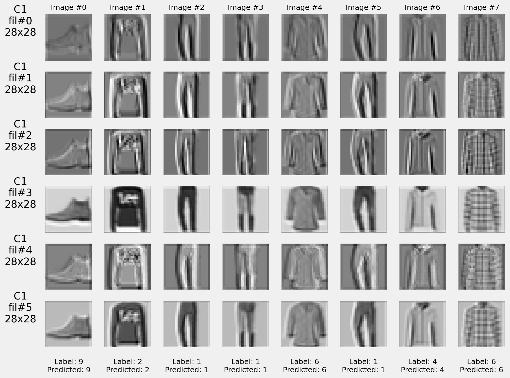
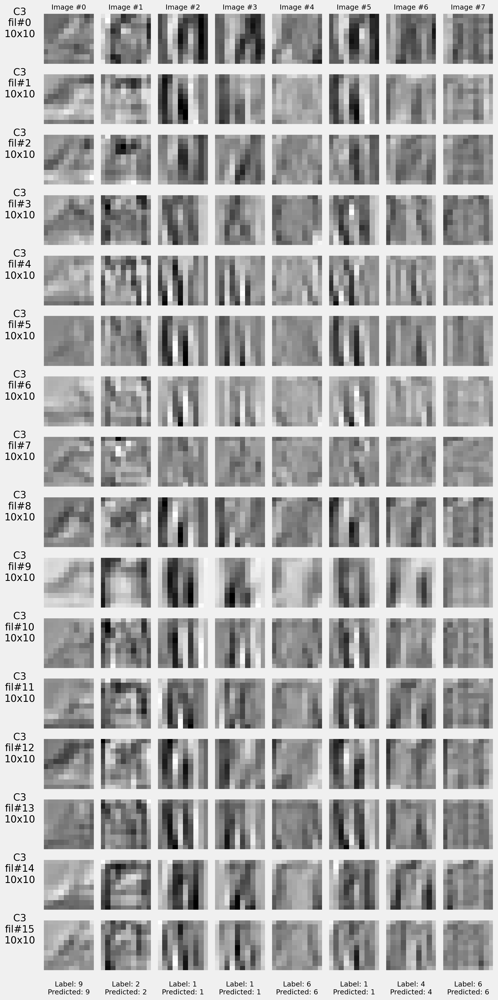
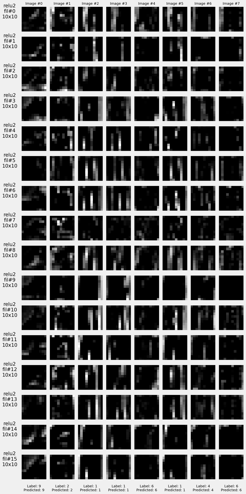

# Implementando uma CNN com `torchvision`

## Apresentação em vídeo

Assista este [vídeo](https://drive.google.com/file/d/1eYax-Y0QkGxtMENOwHANpslVb99wASGz/view?usp=sharing) para entender mais sobre este experimento.

## Proposta

Uma Rede Neural Convolucional utiliza filtros bidimensionais para extrair _features_ a partir de imagens, que alimentarão pesos de uma rede neural. O objetivo da atividade é utilizar um dos datasets presentes na biblioteca `torchvision` para treinar uma CNN que irá classificar elementos do dataset FashionMNIST.

## Treinamento

Utilizando a classe `Architecture` proposta em aula, um modelo similar ao LeNet foi implementado, dispondo de camadas convolucionais, seguidas de camadas ReLU e camadas de max pooling.

## Resultados

Inicialmente, o modelo LeNet-like não possuía camadas de dropout. Isto levou a um problema de overfitting, onde a função de perda do treinamento diminuía, mas a função de perda para o conjunto de validação não estava decrescendo. Com isso, A função de perda mostrou um comportamento mais satisfatório:

Com este resultado, verificamos os seguintes resultados para o conjunto de validação:

| Classe        | Precisão  | Revocação | F1-score | Suporte |
|---------------|-----------|-----------|----------|---------|
| T-shirt/top   | 0.8600    | 0.8480    | 0.8540   | 1000    |
| Trouser       | 0.9959    | 0.9770    | 0.9864   | 1000    |
| Pullover      | 0.8485    | 0.8400    | 0.8442   | 1000    |
| Dress         | 0.8837    | 0.9350    | 0.9086   | 1000    |
| Coat          | 0.8233    | 0.8480    | 0.8355   | 1000    |
| Sandal        | 0.9826    | 0.9620    | 0.9722   | 1000    |
| Shirt         | 0.7415    | 0.6970    | 0.7186   | 1000    |
| Sneaker       | 0.9295    | 0.9760    | 0.9522   | 1000    |
| Bag           | 0.9733    | 0.9830    | 0.9781   | 1000    |
| Ankle boot    | 0.9764    | 0.9530    | 0.9646   | 1000    |
| **Accuracy**      |           |        | **0.9019** | **10000** |
| **Macro avg**     | 0.9015    | 0.9019 | 0.9014   | 10000    |
| **Weighted avg**  | 0.9015    | 0.9019 | 0.9014   | 10000    |

gerando a seguinte matriz de confusão:

Também foram inseridos _hooks_ em diversas camadas, a fim de capturar os _feature maps_ de todas as camadas. Aqui estão alguns exemplos:

### Primeira camada convolucional

### Após ReLU

### Segunda camada convolucional

### Segunda aplicação do ReLU

## Discussão

Com estes experimentos, verificamos a qualidade da CNN em detectar features de imagens para classificação. Apesar da necessidade do dropout, a pipeline de treinamento se mostra simples, e os resultados, satisfatórios. É interessante notar que a classe com a menor precisão é a camisa, e a partir da matriz de confusão podemos notar como as classes nas quais camisas foram mais confundidas são similares em silhueta, indicando que a outline do objeto possui mais peso, que está de acordo com o fato de que a primeira camada convolucional, responsável por detectar bordas nas imagens.
